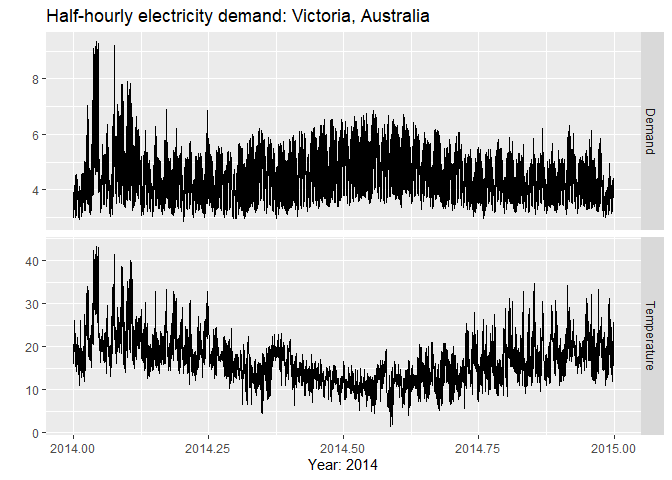
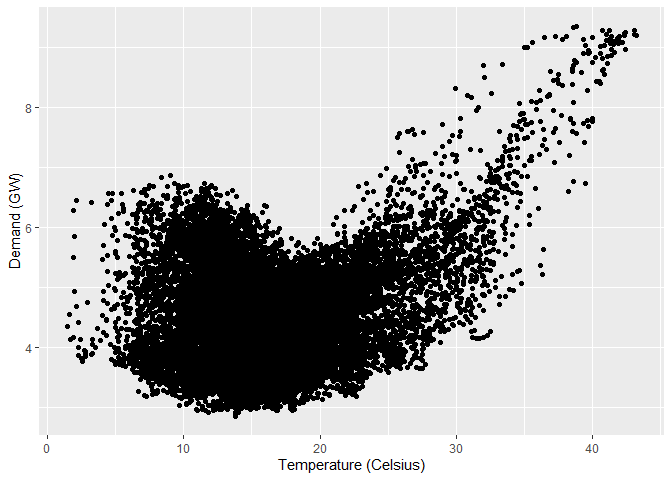
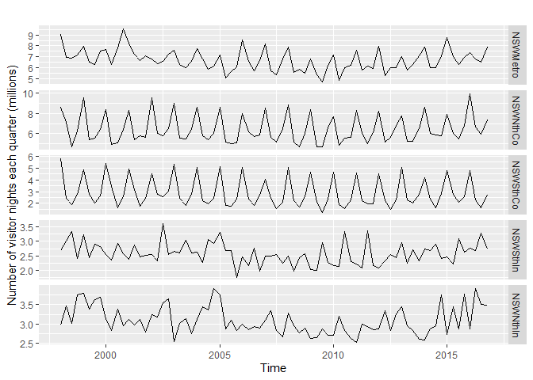
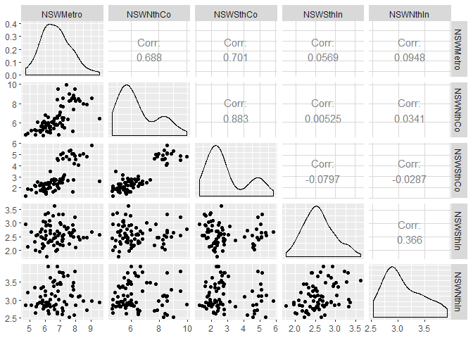
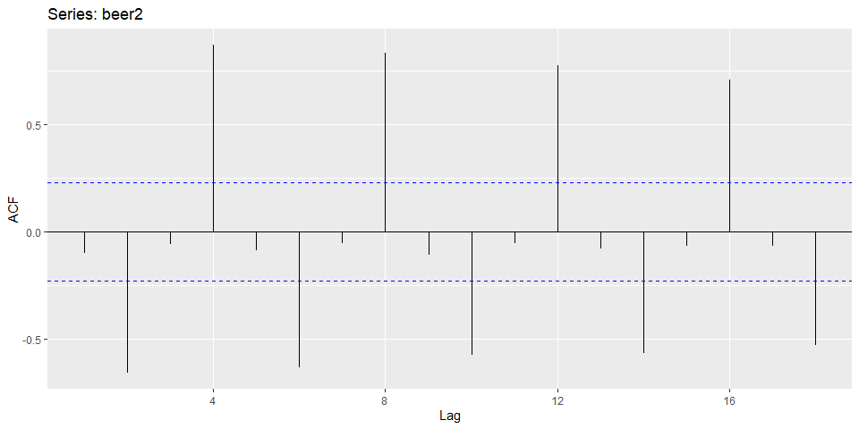

Chapter-2 of Rob J Hyndman book, Forecasting: Principles and Practices
================
28 November 2019

    ## Loading required package: ggplot2

    ## Loading required package: forecast

    ## Registered S3 method overwritten by 'xts':
    ##   method     from
    ##   as.zoo.xts zoo

    ## Registered S3 method overwritten by 'quantmod':
    ##   method            from
    ##   as.zoo.data.frame zoo

    ## Registered S3 methods overwritten by 'forecast':
    ##   method             from    
    ##   fitted.fracdiff    fracdiff
    ##   residuals.fracdiff fracdiff

    ## Loading required package: fma

    ## Loading required package: expsmooth

    ## Time Series:
    ## Start = 2012 
    ## End = 2016 
    ## Frequency = 1 
    ## [1] 123  39  78  52 110

Time plots
----------

``` r
autoplot(melsyd[, "Economy.Class"])+
  ggtitle("Economy class passengers: Melbourne-Sydney") + 
  xlab("Year") + 
  ylab("Thousands")
```


``` r
autoplot(a10) +
  ggtitle("Antidiabetic drug sales") +
  ylab("$ million") +
  xlab("Year")
```


Time series patterns
--------------------

#### Trend

> A trend exists when there is a long-term increase or decrease in the data. It does not have to be linear. Sometimes we will refer to a trend as "changing direction", when it might go from an increasing trend to a decreasing trend.

#### Seasonal

> A seasonal pattern occurs when a time series is affected by seasonal factors such as the time of the year or the day of the week. Seasonality is always of a fixed and known frequency.

#### Cycle

> A cycle occurs when the data exhibit rises and falls that are not of a fixed frequency. These fluctuations are usually due to economic conditions, and are often related to the "business cycle". The duration of these fluctuations is usually at least 2 years.

**Confusion of cyclicity with seasonality:** *if fluctuations are not of fixed frequency then they are cyclic; if the frequency is unchanging and associated with some aspect of the calendar, then the pattern is seasonal. The average length of cycles is longer than the length of the seasonal pattern, and the magnitudes of cycles tend to be more variable than the magnitudes of seasonal patterns.*

Seasonal plots
--------------

``` r
ggseasonplot(a10, year.labels = TRUE, year.labels.left = TRUE) +
  ylab("$ million") +
  ggtitle("Seasonal plot: antidiabetic drug sales")
```


``` r
ggseasonplot(a10, polar = TRUE) +
  ylab("$ million") +
  ggtitle("Polar Seasonal plot: antidiabetic drug sales")
```


Seasonal subseries plots
------------------------

``` r
ggsubseriesplot(a10) +
  ylab("$ million") +
  ggtitle("Seasonal subseries plot: antidiabetic drug sales")
```


Scatterplots
------------

``` r
autoplot(elecdemand[,c("Demand", "Temperature")], facets = TRUE) +
  xlab("Year: 2014") + ylab("") +
  ggtitle("Half-hourly electricity demand: Victoria, Australia")
```

    ## Warning: Ignoring unknown parameters: series



*To study the relationship between demand and temperature; plotting one series against the other.*

``` r
qplot(Temperature, Demand, data = as.data.frame(elecdemand)) +
  ylab("Demand (GW)") +
  xlab("Temperature (Celsius)")
```



### Correlation

> correlation coefficients measure the strength of the relationship between 2 variables.

$$r = \\frac{\\sum  (x\_{t}-  \\overline{x} )  (y\_{t} - \\overline{y})} {\\sqrt(\\sum (x\_{t}-\\overline{x})^{2}) \\sqrt(\\sum (y\_{t}-\\overline{y})^{2})}$$

> The value of `r` always lies b/w -1 & 1 with negative values indicating a negative relationship & positive value indicating a positive relationship.

> The correlation coefficient only measures the strength of the linear relationship.

### Scatterplot matrices

``` r
autoplot(visnights[,1:5], facets = TRUE) +
  ylab("Number of visitor nights each quarter (millions)")
```



**Relationships between these five time series, plotting each time series against the others.**

``` r
GGally::ggpairs(as.data.frame(visnights[,1:5]))
```

    ## Registered S3 method overwritten by 'GGally':
    ##   method from   
    ##   +.gg   ggplot2



> The value of the scatterplot matrix is that it enables a quick view of the relationships between all pairs of variables.

Lag plots
---------

``` r
beer2 <- window(ausbeer, start=1992)
gglagplot(beer2)
```

 &gt; Here the colours indicate the quarter of the variable on the vertical axis. The lines connect points in chronological order. The relationship is strongly positive at lags 4 and 8, reflecting the strong seasonality in the data. The negative relationship seen for lags 2 and 6 occurs because peaks (in Q4) are plotted against troughs (in Q2)

> The window() function used here is very useful when extracting a portion of a time series.

Autocorrelation
---------------

> It measures the linear relationship between *lagged* values of a time series.

$$r\_{k} =  \\frac{ \\sum\_{t=k+1}^{T} ( y\_{t} -  \\overline{y}) ( y\_{t-k}-  \\overline{y} )} { \\sum\_{t=1}^{T} ( y\_{t} -  \\overline{y} )^2 } $$

    T = length of the time series
    k = lag term

> The autocorrelation coefficients are calculated to show the *autocorrelation function* or *`ACF`*. Lag plots correspond to the value of autocorrelation coeffecients.

> **ACF** plot is known as correlogram

``` r
head(beer2,2)
```

    ##      Qtr1 Qtr2
    ## 1992  443  410

``` r
ggAcf(beer2)
```



> In this graph: - *r*4 is higher than for the other lags. This is due to the seasonal pattern in the data: the peaks tend to be four quarters apart and the troughs tend to be four quarters apart. - *r*2 is more negative than for the other lags because troughs tend to be two quarters behind peaks. - The dashed blue lines indicate whether the correlations are significantly different from zero.

### Trend and seasonality in ACF plots

> When data have a trend, the autocorrelations for small lags tend to be large and positive because observations nearby in time are also nearby in size. So the ACF of trended time series tend to have positive values that slowly decrease as the lags increase. When data are seasonal, the autocorrelations will be larger for the seasonal lags (at multiples of the seasonal frequency) than for other lags. When data are both trended and seasonal, you see a combination of these effects.

``` r
aelec <- window(elec, start = 1980)
autoplot(aelec) +
  xlab("year") +
  ylab("GWh")
```


``` r
ggAcf(aelec, lag = 48)
```


> The slow decrease in the ACF as the lags increase is due to the trend, while the "scalloped" shape is due the seasonality.

White noise
-----------

> no autocorrelation in time-series is known as white noise

``` r
set.seed(30)
y <- ts(rnorm(50))

autoplot(y) + ggtitle("White noise")
```


``` r
ggAcf(y)
```


> For white noise series, we expect each autocorrelation to be close to zero. Of course, they will not be exactly equal to zero as there is some random variation. For a white noise series, we expect 95% of the spikes in the ACF to lie within $\\pm\\frac{2}{\\sqrt(T)}$ where **T** is the length of the time series. It is common to plot these bounds on a graph of the ACF (the blue dashed lines above). If one or more large spikes are outside these bounds, or if substantially more than 5% of spikes are outside these bounds, then the series is probably not white noise.

> In this above shown plot, T=50 and so the bounds are at $\\pm\\frac{2}{\\sqrt(50)}$ = $. All of the autocorrelation coefficients lie within these limits, confirming that the data are white noise.
